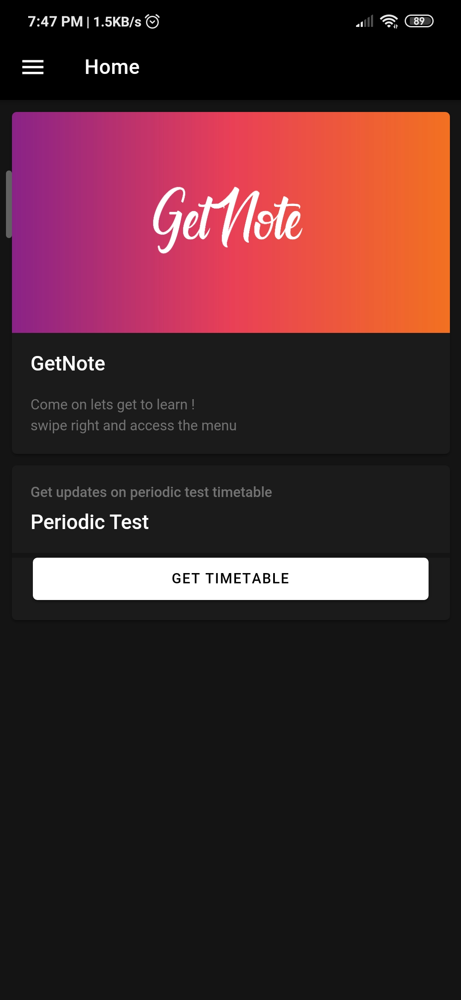

# getnote-simple-college-app
This app is an simple app to download college study materials

# made with
ionic framework 
cordova build 
and also :heart:

# requirements
ionic android sdk build & platform tools cordova Java Development Kit and Hope :-)

# cordova/ionic plugins added
cordova-plugin-androidx 1.0.2 "cordova-plugin-androidx" 
cordova-plugin-androidx-adapter 1.1.0 "cordova-plugin-androidx-adapter" 
cordova-plugin-device 2.0.2 "Device" 
cordova-plugin-file 6.0.2 "File" 
cordova-plugin-file-opener2 2.2.1 "File Opener2" 
cordova-plugin-file-transfer 1.7.1 "File Transfer" 
cordova-plugin-ionic-keyboard 2.2.0 "cordova-plugin-ionic-keyboard" 
cordova-plugin-ionic-webview 4.1.3 "cordova-plugin-ionic-webview" 
cordova-plugin-splashscreen 5.0.2 "Splashscreen" 
cordova-plugin-statusbar 2.4.2 "StatusBar" 
cordova-plugin-whitelist 1.3.3 "Whitelist" 

# steps to build
1.) install the requirements 
2.) open the project with ionic CLI 
3.) add platforms (android / IOS / WebApp(PWA) / electron) 
4.) add cordova plugins 
5.) use command <b>"ionic cordova build"</b> 
6.) Now test the debug(test) application 
7.) Then build release version and distribute 

#### Admob (Google ads) can be added if you want in the app   msraj085@gmail.com   mail me for the code or soon i will update the code 

# Screenshots

# Sample apk
The sample apk is found in **src/dist/sampledebug.apk**
